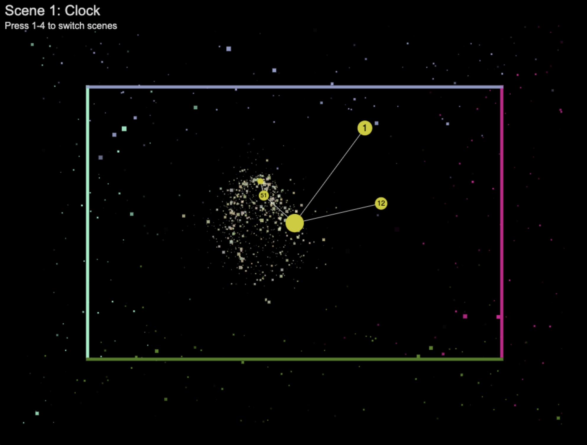
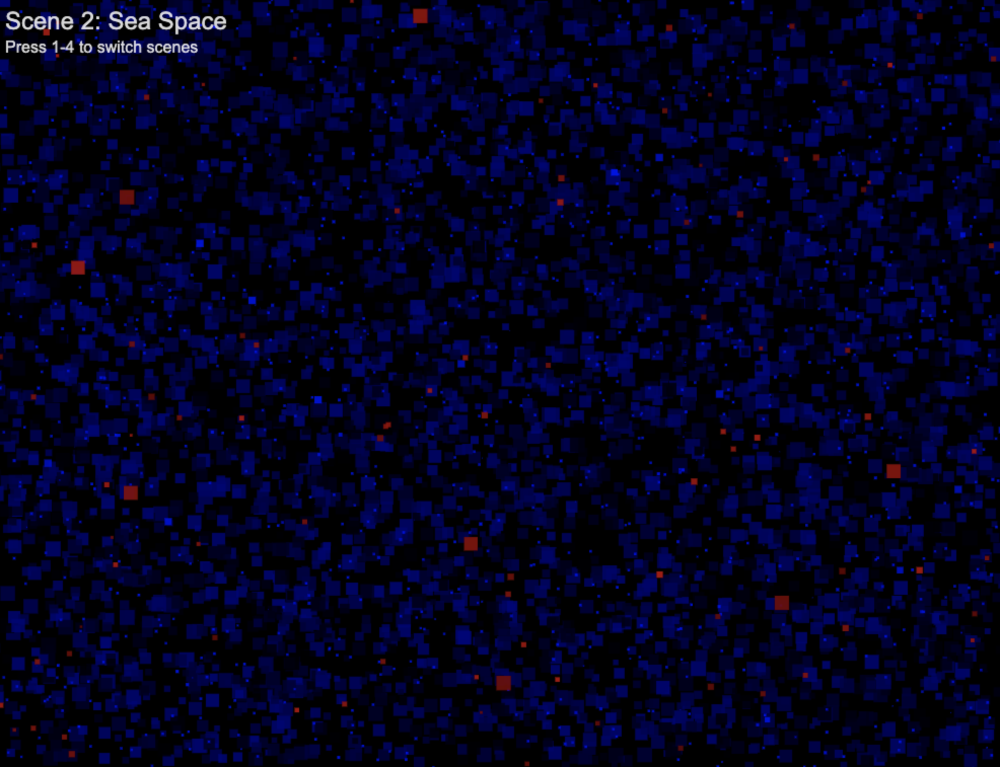
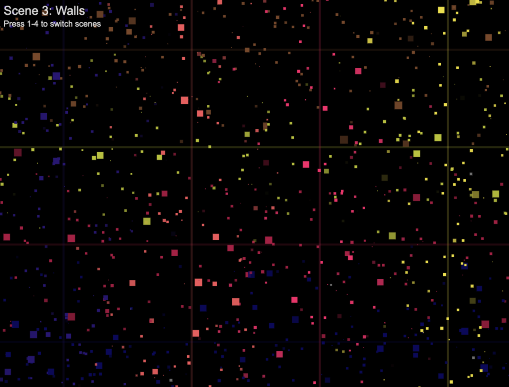
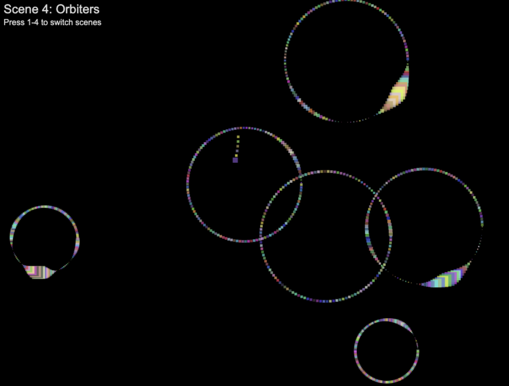
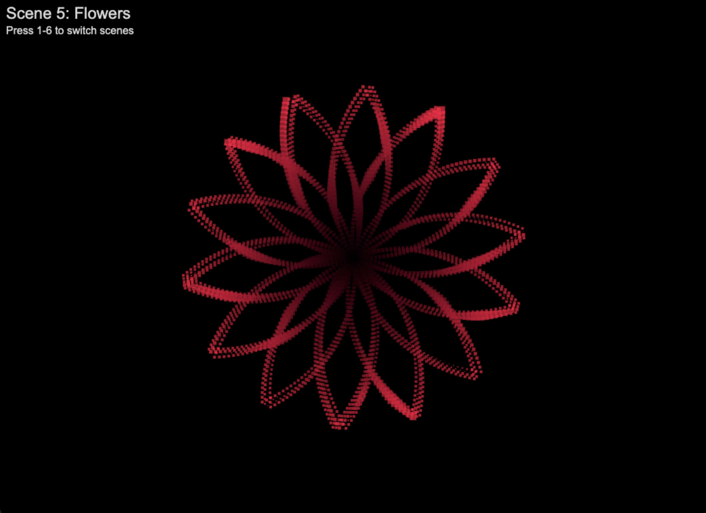
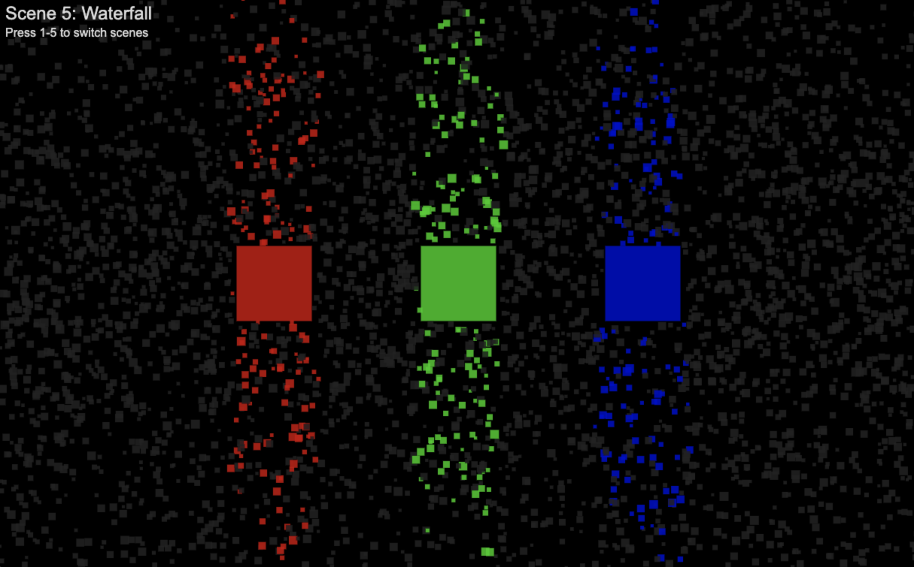

# Canvas Art

Deep dive into canvas rendering, collision detection, coordinate mapping, and various concepts within the architecture of a game loop.

## Setup

clone this repo, then:

```
npm install
npm start
```

## Examples

This repo is hosted at [https://canvas.codefly.ninja](https://canvas.codefly.ninja/)

Each example is represented as a `Scene`, which can be cycled through using the numeric keys on your keyboard.

### Orbital Clock

Uses radian calculations to find a coordinate at an angle and distance. Shows hours, minutes, seconds, and milliseconds, plotted at vertices relative to a center point. (the sun)

You'll notice the hands of the orbital clock are exactly opposite of what we would expect when looking at an analog analog clock. However, in order for this to align with what we know of orbital mechanics, the object that is rotating the fastest, must also be the closest to a given center point.


### Sea Space

Showcases basic boundary detection and rendering thousands of particles to the screen simultaneously. Heavy use of randoms to ensure the scene is dynamic. Also leverages various easing functions to manipulate the size of each particle, based on random time, duration, and min/max sizing parameters.


### Walls

Introduction of walls for testing collision detection between objects. Showcases deflection using angle of attack calculations, whereby the points on a square are used to determine its hit range (top, right, bottom, left) in degrees (0-360), allowing for more precise deflection mechanics along its respective x/y velocity.


### Orbiter

First of the radian calculations, where circles are drawn around a randomized central point in 2d space. Using an angle between 0-360, a radius, and a center point, we determine the coordinates of any given point away from the center.


### Flowers

Building on the Orbiter scene, which modifies only the angle used to plot coordinates at each frame, this scene adds oscillations to the radius from 0-r. Additionally, rendering multiple points per frame can help speed up the animation, where the Orbiter scene is constrained to one particle per frame. (60 frames, 60 particles per second)


### Waterfall

Color effect with particles and walls, where particles pick up the color of the wall they hit. 4000 particles rendered in the upper and lower canvas with a randomized velocity, mostly in the Y axis, followed by collision detection between particles and R,G,B walls

